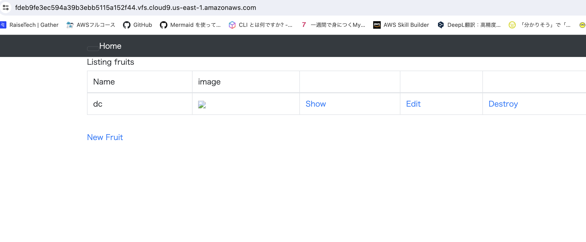
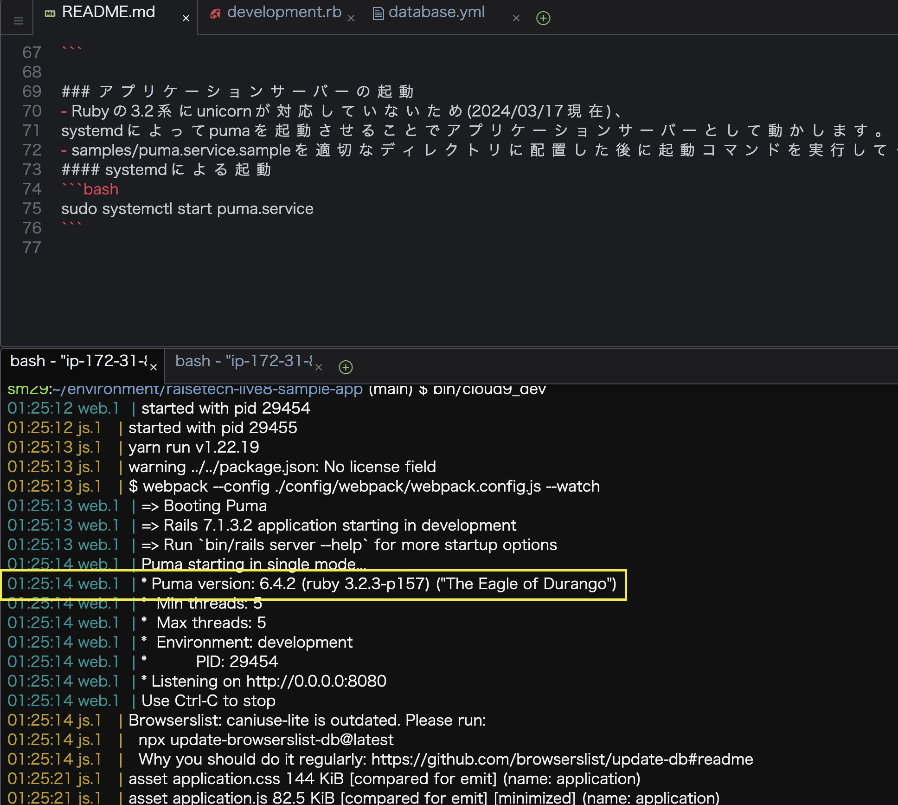
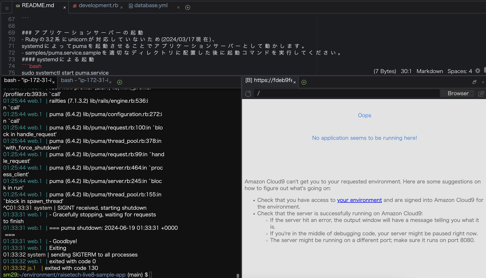
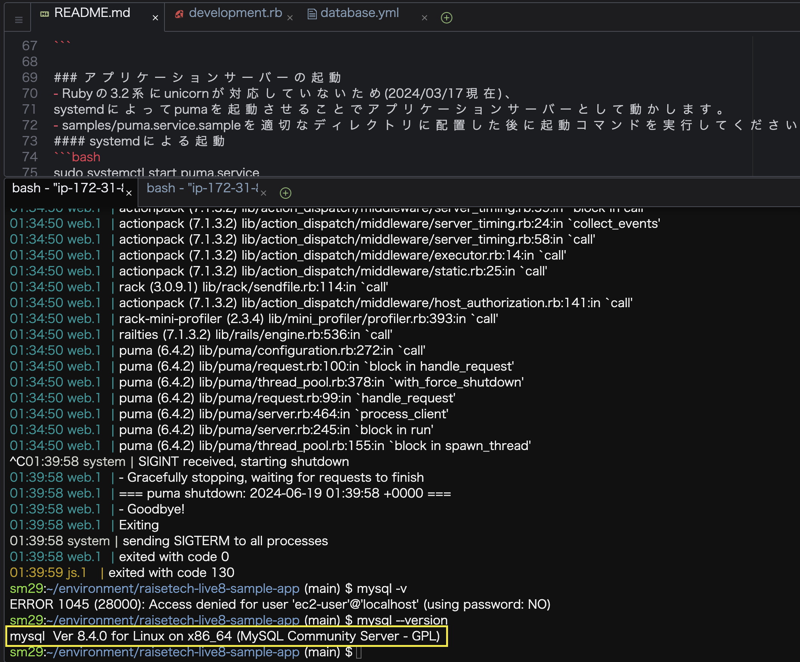
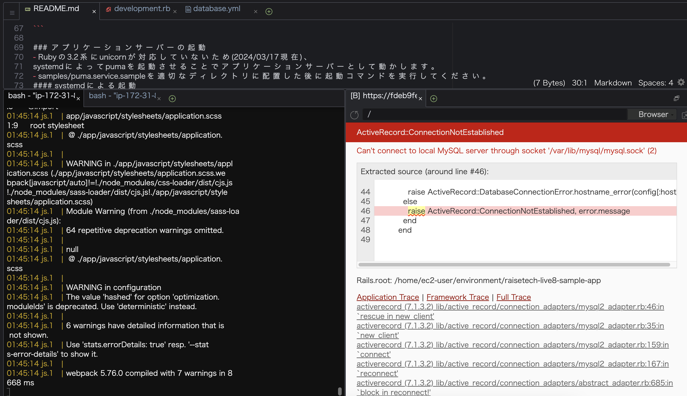

# 第3回課題

## サンプルアプリケーションの起動

## 1.APサーバーについて調べる
- puma version 6.4.2

- AP サーバーを終了させた場合、引き続きアクセスできません。

## 2. DB サーバーについて調べる
- サンプルアプリケーションで使ったDB サーバー（DB エンジン）の名前と今Cloud9で動作しているバージョンの確認：mySQL version 8.4.0

- DB サーバーを終了させた場合、引き続きアクセスできなくなりました。

- Railsの構成管理ツールの名前：Bundler

## 今回の課題から学んだこと、感じたこと

- サンプルアプリケーションの起動にとても時間がかかってしまった。アプリケーション起動の仕組みについて後日学び直したいです。
- 時間をかけすぎたのでもっと効率よく課題ができるようになりたいです。
